# Cars Hub - Testing

Welcome to Cars Hub – Your Trusted Car Enthusiast Platform

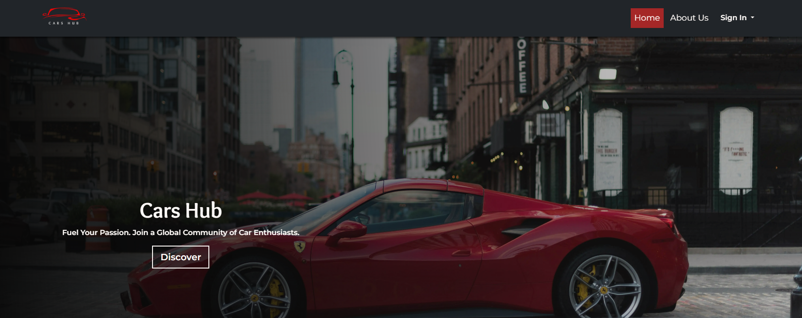

Visit the deployed site: [Cars Hub](https://cars-enthusiast-platform-967e10cbb827.herokuapp.com/)

  

- - -

## CONTENTS
* [Test Users for Review](#test-users-for-review)
  * [Login Credentials](#login-credentials)
  * [How to Use](#how-to-use)

* [Validation TESTING](#validation-testing)
  * [W3C Validator](#w3c-validator)
  * [JavaScript Validator](#javascript-validator)
  * [Python Validator](#python-validator)
  * [Lighthouse](#lighthouse)

* [Automated Testing](#automated-testing)

* [MANUAL TESTING](#manual-testing)
  * [Testing User Stories](#testing-user-stories)
  * [Full Testing](#full-testing)

* [Bugs](#bugs)
  * [Solved Bugs](#solved-bugs)
  * [Known Bugs](#known-bugs)

- - -

## Test Users for Review

To facilitate testing and review of the **Cars Hub** website, the following test user accounts have been created. Each user has specific access permissions and roles to demonstrate different parts of the platform.
Or you can create new account.

### Login Credentials

| Username  | Password      | Role         |
| --------- | ------------- | ------------ |
| majd | H@khan159  | Regular User |
| fatima | h@kal1234  | Regular User |
| jouri  | m@zal1234 | Regular User |
| houria  | ASDFg1234 | Superuser    |

* **Regular Users** can browse the site, add cars, like cars, and manage their own content.
* **Superuser** accounts have full access to the Django admin and all site functionality.

### How to Use

1. Visit the [Login Page](https://cars-enthusiast-platform-967e10cbb827.herokuapp.com/accounts/login/)
2. Use any of the above credentials to sign in and explore the functionality based on the user's role.

---

## VALIDATION TESTING

### W3C Validator

[W3C](https://validator.w3.org/) was used to validate the HTML and CSS of the website.

| Page | Result |
| :----------: | :-------: |
| Home Page | Pass|
| Car Detail Page | Pass |
| About Page | Pass |
| Signin Page | Pass |
| Signup Page | Pass |
| Signout Page | Pass |
| Profile Page | Pass |
| Cars List Page | Pass |
| Car Edit Page | Pass |
| Car Edit Page | Pass |
| Likes List Page | Pass |
| Error 400 Page | Pass |
| Error 403 Page | Pass |
| Error 404 Page | Pass |
| Error 500 Page | Pass |

| File | Result |
| :---: | :---: |
| carousel.css | Pass|
| custom_dropzone.css | Pass |
| profile.css | Pass |
| style.css | Pass, *one warning its about the imported fonts.* |

- - -

### JavaScript Validator

[JS Hint](https://jshint.com/) was used to validate the JavaScript.

| File | Result |
| :---: | :---: |
| car-detail.js | Pass |
| car-form.js | Pass |
| carousel.js | Pass |
| custom_dropzone.js | Pass |
| main.js | Pass |
| profile.js | Pass |

*All files are passed with some warnings. let, const, for of and array functions (filter, find, every, map) are only available in ES6.*

- - -

### Python Validator

[Code Institute Python Linter](https://pep8ci.herokuapp.com/) was used to validate the python files.

| File | Result |
| :---: | :---: |
| car/admin | Pass |
| car/forms | Pass |
| car/models | Pass |
| car/test_forms | Pass |
| car/test_views | Pass |
| car/urls | Pass |
| car/views | Pass |
| car/widgets | Pass |
| about/admin | Pass |
| about/forms | Pass |
| about/models | Pass |
| about/test_forms | Pass |
| about/test_views | Pass |
| about/urls | Pass |
| about/views | Pass |
| errors/views | Pass |

---
### Lighthouse

I used Lighthouse within the Chrome Developer Tools to test the performance, accessibility, best practices and SEO of the website.

**Homepage**

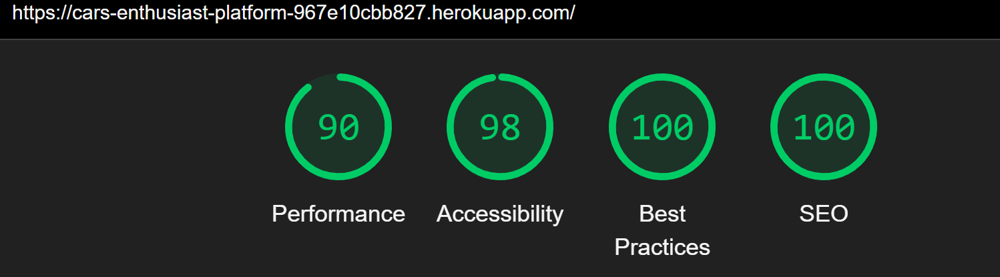

**Car Detail Page** (without login)

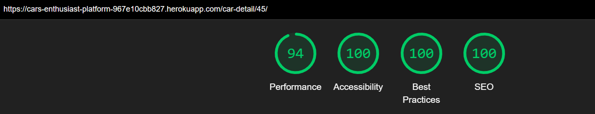

**Car Detail Page** (with login)

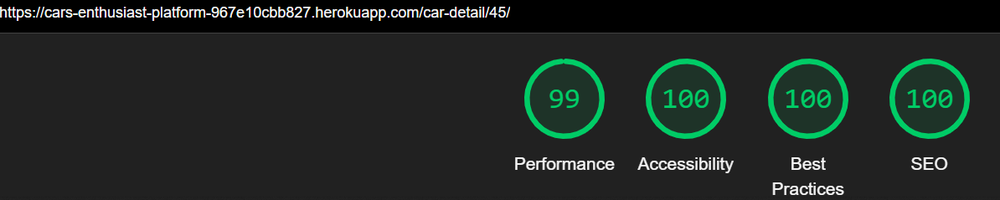

**About Page**

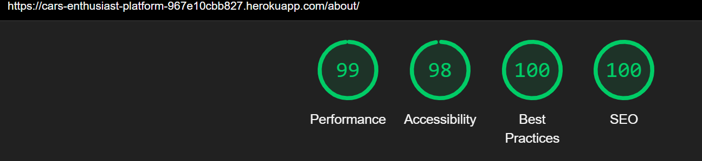

**Profile Page**

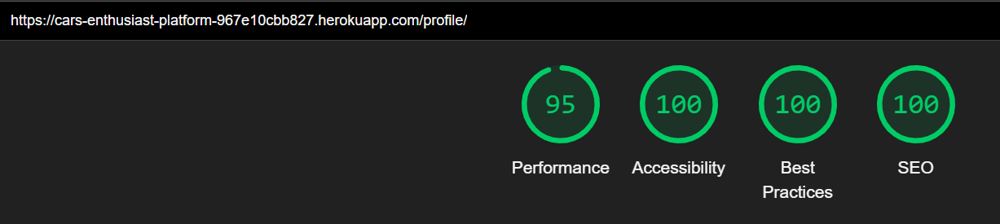

**Cars List Page**

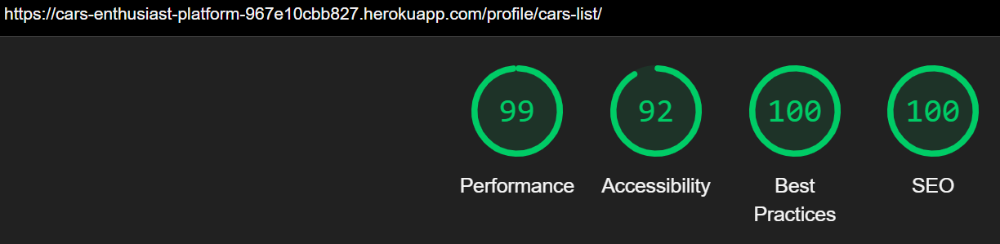

**Car Add Page**

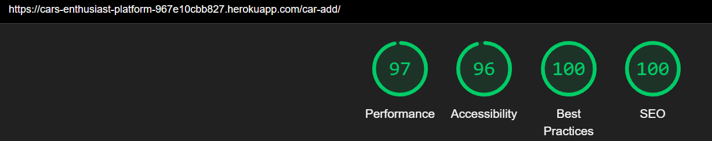

**Car Edit Page**

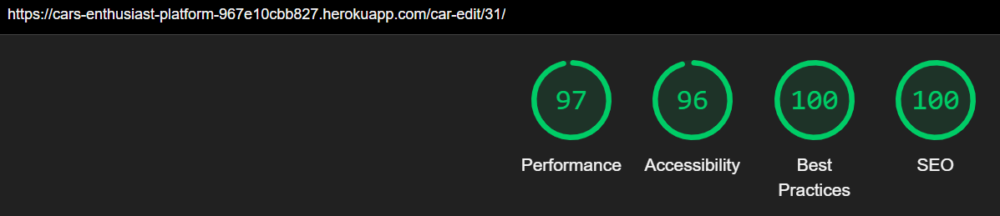

**Likes List Page**

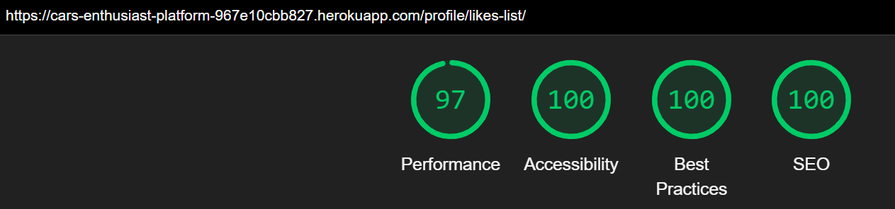

**Signin Page**

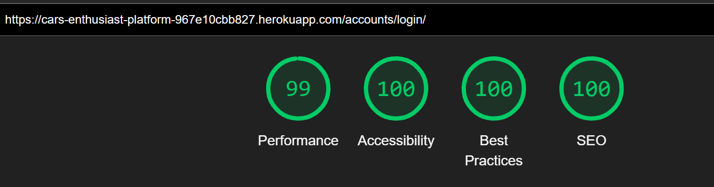

**Signup Page**

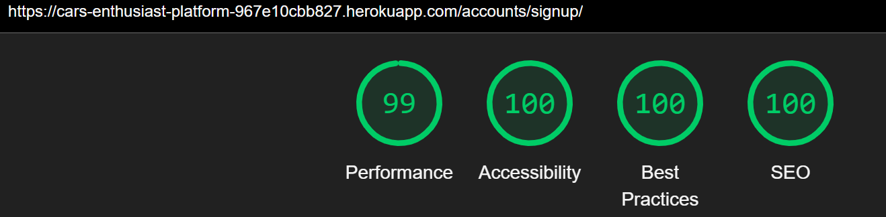

**Signout Page**

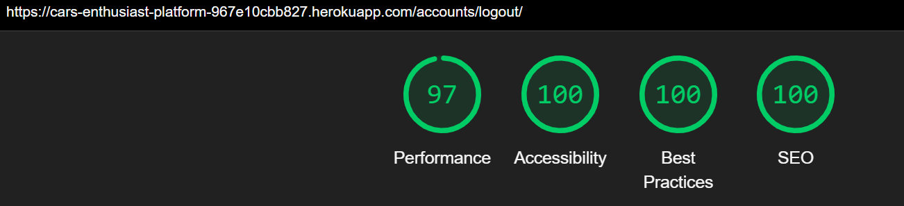

**Error Page**

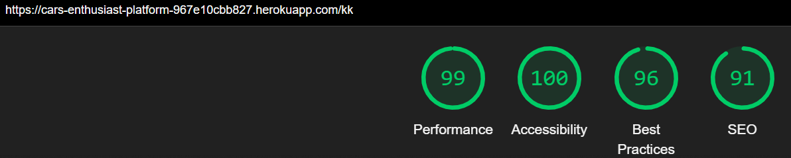

- - -
## Automated Testing

Automated testing for this project was carried out with [Django TestCase](https://docs.djangoproject.com/en/4.1/topics/testing/overview/).

I also used [coverage](https://pypi.org/project/coverage/) to enable me to see where I was missing tests from to enable me to test my application more thoroughly.

### Coverage Testing

| Coverage for | Total |
| :---: | :---: |
| Car | 96% |
| About | 98% |

- - -

## Manual Testing

### Testing User Stories

| User Story ID | As a/an | I want to be able to | So that I can... | How is this achieved? |
| :----------------------- | :------------- | :-------------------------------------- | :-----------------------------------| :------------------------------------------------- |
| **VIEWING & NAVIGATION** | | | | |
| 1 | Visitor | View all published cars on the homepage | Browse available cars easily | The homepage displays all published cars with filtering and search functionality. |
| 2 | Visitor | View detailed information about a car | Understand the car’s features and decide whether to interact | The detail page shows images, description, post date, and owner. |
| 3 | Logged-in User | Add comments and likes to a car | Share feedback and engage with listings | Logged-in users see the comment box and like button on the detail page. |
| 4 | Comment Owner | Edit or delete my comment | Manage my contributions | If the user owns the comment, options to edit and delete are shown. |
| **INFORMATION & CONTACT** |
| 5 | Visitor | Learn more about the site | Understand the site's purpose | The About page shows admin-managed content. |
| 6 | Visitor | Submit an inquiry | Ask questions or send feedback | Inquiry form is available on the About page. |
| **USER ACCOUNTS & AUTHENTICATION** |
| 7 | New User | Sign up for an account | Access personalized features | Users can register via the dropdown in the navbar. |
| 8 | Returning User | Sign in to my account | Access and manage my content | Sign-in is available via the navbar dropdown. |
| 9 | Logged-in User | See profile and logout options | Manage my account or log out | A dropdown with profile and logout links appears under the username in the navbar. |
| 10 | Admin | Access the admin dashboard | Manage site content and users | Admins see an extra link to the Admin Panel in the dropdown menu. |
| **USER PROFILE & PERSONAL CONTENT** |
| 11 | Logged-in User | View and edit my profile | Keep my information up to date | The Profile page displays a form for editing user info and image. |
| 12 | Logged-in User | See a list of my submitted cars | Manage my listings | The Cars List page shows a paginated list of the user's cars with search and filters. |
| 13 | Car Owner | Edit or delete my approved cars | Manage my published content | Approved cars show edit and delete buttons. |
| 14 | Car Owner | See unapproved cars marked clearly | Understand pending status | Unapproved cars are overlaid and tagged as needing admin approval. |
| 15 | Car Owner | Add or edit a car with images | Upload content effectively | Add/Edit pages include a car form with multi-image upload support. |
| **LIKES & FEEDBACK** |
| 16 | Logged-in User | See a list of cars I liked | Revisit cars I'm interested in | Likes page displays all liked cars by the user. |
| 17 | User | Get feedback when something goes wrong | Understand what happened and how to proceed | Custom 400, 403, 404, and 500 error pages show a message and link back to homepage. |
| **INTERACTIONS & UX ENHANCEMENTS** |
| 18 | User | Confirm delete actions | Avoid accidental deletions | All delete buttons trigger a confirmation modal. |
| 19 | User | See a loading indicator | Know something is processing | AJAX requests show a loading spinner while fetching data. |
| 20 | User | Get visual feedback for actions | Understand success or errors | Toast messages display all success and error notifications. |
| **ADMIN & TESTING** |
| 21 | Admin | Manage backend efficiently | Oversee all content and users | Admin panel is customized using Jazzmin for a better UI. |
| 22 | Developer | Test forms and views | Ensure site reliability | Unit tests have been written for Django forms and views. |

- - -

### Full Testing

Full testing was performed on the following devices:

* Laptop:
  * HP Laptop 17 2021
* Mobile Devices:
  * iPhone 14 pro max.
  * samsung A53.

Each device tested the site using the following browsers:

* Google Chrome
* Safari
* Microsoft Edge

**Additional Test**

`Home Page`

| Feature | Expected Outcome | Testing Performed | Result | Pass/Fail |
| ----------- | --------- | --------- | ----------------- | --------- |
| Navbar - Logo | Clicking the logo redirects to the home page. | Clicked logo | Redirects to home page. | Pass |
| Navbar - Home Link | Click navigates to homepage. | Clicked Home | Reloads homepage. | Pass |
| Navbar - About Link | Click navigates to about page. | Clicked About | Redirects to About page. | Pass |
| Navbar - Sign in/Sign up links | Appear when user is not logged in. | Verified as guest | Sign in and Sign up shown. | Pass |
| Navbar - Profile/Logout links | Appear after logging in. | Logged in and clicked username dropdown | Profile and Logout shown. | Pass |
| Navbar - Admin Panel link | Appears only when admin is logged in. | Logged in as admin | Admin Panel link visible. | Pass |
| Homepage loads all published cars | User can browse cars with filters and search | Visited homepage | Cars are displayed correctly with filters and search working | Pass |
| Search bar | Filters cars based on keyword | Searched for "Toyota" | Only Toyota cars displayed | Pass |
| Filter | Filters cars based on category  | Selected "Luxury" category | Luxury cars shown only | Pass |
| Car detail button | Navigates to car detail page | Clicked on a car | Redirected to car detail with full info | Pass |
| Toaster feedback | Shows messages on actions | loggedin/loggedout user | Success toaster shown | Pass |
| Footer | Displays contact info and address map. | Scrolled to footer | Footer visible with correct info. | Pass |

 `Car Detail Page`

| Feature | Expected Outcome | Testing Performed | Result | Pass/Fail |
| ------- | -------------------------- | --------------- | ----------- | --------- |
| Navbar - Logo | Clicking the logo redirects to the home page. | Clicked logo | Redirects to home page. | Pass |
| Navbar - Home Link | Click navigates to homepage. | Clicked Home | Reloads homepage. | Pass |
| Navbar - About Link | Click navigates to about page. | Clicked About | Redirects to About page. | Pass |
| Navbar - Sign in/Sign up links | Appear when user is not logged in. | Verified as guest | Sign in and Sign up shown. | Pass |
| Navbar - Profile/Logout links | Appear after logging in. | Logged in and clicked username dropdown | Profile and Logout shown. | Pass |
| Navbar - Admin Panel link | Appears only when admin is logged in. | Logged in as admin | Admin Panel link visible. | Pass |
| Car details visible | Shows images, description, date, owner | Opened a car page | All info displayed | Pass |
| Comments box | Visible only when logged in | Viewed as logged in user | Comment box visible | Pass |
| Like button | Enabled when logged in | Logged in and clicked like | Like added | Pass |
| Comment management  | Edit/delete if user owns comment | Added comment and clicked manage | dropdown gear icon shown, contains Edit/Delete links | Pass |
| Toaster feedback | Shows messages on actions | User adds, edits, deletes a comment or likes car post | Success/Error toaster shown | Pass |
| Footer | Displays contact info and address map. | Scrolled to footer | Footer visible with correct info. | Pass |

`About Page`

| Feature | Expected Outcome | Testing Performed | Result | Pass/Fail |
| ------- | ------------- | -------------- | ------------ | --------- |
| Navbar - Logo | Clicking the logo redirects to the home page. | Clicked logo | Redirects to home page. | Pass |
| Navbar - Home Link | Click navigates to homepage. | Clicked Home | Reloads homepage. | Pass |
| Navbar - About Link | Click navigates to about page. | Clicked About | Redirects to About page. | Pass |
| Navbar - Sign in/Sign up links | Appear when user is not logged in. | Verified as guest | Sign in and Sign up shown. | Pass |
| Navbar - Profile/Logout links | Appear after logging in. | Logged in and clicked username dropdown | Profile and Logout shown. | Pass |
| Navbar - Admin Panel link | Appears only when admin is logged in. | Logged in as admin | Admin Panel link visible. | Pass |
| Admin content displayed | Page shows admin text | Visited About page | Content rendered correctly | Pass |
| Inquiry form | Submits message to admin | Submitted form | Form submits and shows success toaster | Pass |
| Toaster feedback | Shows messages on actions | User request inquiry | Success/Error toaster shown | Pass |
| Footer | Displays contact info and address map. | Scrolled to footer | Footer visible with correct info. | Pass |

`Sign In Page`

| Feature | Expected Outcome | Testing Performed | Result | Pass/Fail |
| ------  | ---------------- | ----------------- | -------| --------- |
| Navbar - Sign In indicator | Navbar highlights Sign In page. | Opened Sign In page | "Sign In" link highlighted in navbar. | Pass |
| Sign In Form - Fields | Shows fields for username and password. | Opened page | Both input fields present. | Pass |
| Sign In Form - Validation  | Empty/Wrong entry fields display error. | Submitted with empty or wrong info fields | Validation error shown. | Pass |
| Link to Sign Up | Redirects to Sign Up page. | Clicked link | Redirected to Sign Up page. | Pass |
| Successful Login | Redirects to home and shows toaster. | Entered valid credentials | Redirected to home with success toast: "Successfully logged in." | Pass |
| Redirect After Login | If redirected from a protected page, returns there after login. | Tried to access /profile while logged out | Redirected to Sign In, then back to /profile after login. | Pass |

`Sign Up Page`

| Feature | Expected Outcome | Testing Performed | Result | Pass/Fail |
| ------  | ---------------- | ----------------- | -------| --------- |
| Navbar - Sign Up indicator | Navbar highlights Sign Up page. | Opened Sign Up page | "Sign Up" link highlighted. | Pass |
| Sign Up Form - Fields | Shows fields for username, email, password, confirm password. | Verified form | All fields present. | Pass |
| Sign Up Form - Validation  | Empty or mismatched passwords show error. | Tried various invalid inputs | Errors displayed. | Pass |
| Link to Sign In | Redirects to Sign In page. | Clicked link | Redirected to Sign In. | Pass |
| Successful Registration | Redirects to home and logs in user. | Submitted valid form | Redirected to home with success toast: "Account created and logged in." | Pass |

`Sign Out Page`

| Feature | Expected Outcome | Testing Performed | Result | Pass/Fail |
| ------  | ---------------- | ----------------- | -------| --------- |
| Confirmation Message | Displays logout confirmation message. | Navigated to Sign Out | Message visible with logout button. | Pass |
| Logout Button | Logs user out and redirects to homepage. | Clicked logout | User redirected to home. | Pass |
| Toaster | Displays success message on logout. | Observed after logout | Toast shown: "Successfully logged out." | Pass |

`Redirect Behavior for Protected Routes`

| Feature | Expected Outcome | Testing Performed | Result | Pass/Fail |
| ------  | ---------------- | ----------------- | -------| --------- |
| Accessing `/profile` while not logged in | Redirects to Sign In, then back to profile. | Navigated to /profile while logged out | Redirected to Sign In, then to profile after login. | Pass |
| Accessing `/cars-list` while not logged in | Redirects to Sign In. | Tried accessing while logged out | Redirects properly. | Pass |
| Accessing `/add-car`, `/edit-car/:id`, or `/likes` | Redirects to Sign In and then to requested page. | Tested each path while logged out | Redirected and restored correctly after login. | Pass |

`Profile Page`

| Feature | Expected Outcome | Testing Performed | Result | Pass/Fail |
| ------ | ------------ | ----------- | ------------------ | -------- |
| Navbar | Full functionality tested. | Verified | Works as expected. | Pass |
| Sidebar | Shows links to Cars List, Profile, Likes List. | Checked on desktop | Sidebar visible with correct links. | Pass |
| Sidebar - Mobile | Converts to dropdown. | Viewed on mobile | Sidebar replaced by dropdown. | Pass |
| Profile Form | Editable form and profile image upload. | Updated data | Data saved successfully. | Pass |
| Toaster feedback | Shows messages on actions | User update profile info | Success/Error toaster shown | Pass |
| Footer | Consistent footer. | Checked | All info present. | Pass |

`Cars List Page`

| Feature | Expected Outcome | Testing Performed | Result | Pass/Fail |
| ------- | ---------------- | ------------- | ----------- | -------- |
| Navbar | Full functionality tested. | Verified | Works as expected. | Pass |
| Sidebar | Desktop: visible, Mobile: dropdown. | Checked both views | Displays correctly. | Pass |
| Pagination | Works with many cars. | Tested 20+ cars | Pagination navigates correctly. | Pass |
| Filter/Search | Filters and searches work. | Searched and filtered  | Results updated correctly. | Pass |
| Car Edit/Delete | Allowed only if approved. | Viewed approved car | Buttons visible. | Pass |
| Unapproved Overlay | Overlay and admin approval notice.  | Checked unapproved car | Overlay shown. | Pass |
| Toaster feedback | Shows messages on actions | User add/edit/delete car | Success/Error toaster shown | Pass |
| Delete confirmation | Shows modal with confirmation message | User click delete car button | Loader while fetching and Success toaster are shown | Pass |
| Footer | Consistent footer. | Checked | All info present. | Pass |

 `Add/Edit Car Page`

| Feature  | Expected Outcome | Testing Performed | Result | Pass/Fail |
| -------- | ------------- | ---------- | ----------------- | -------- |
| Navbar | Full functionality tested. | Verified | Works as expected. | Pass |
| Sidebar  | Links to profile, cars, likes. | Tested responsiveness | Works on both desktop and mobile. | Pass |
| Car Form | Multi-image upload, fields editable. | Submitted new/edit form | Works correctly. | Pass |
| Toaster feedback | Shows messages on actions | User Add.update car infos or delete images | Success/Error toaster shown | Pass |
| Delete confirmation | Shows modal with confirmation message | User click delete image | Loader while fetching and Success toaster are shown | Pass |
| Footer | Consistent footer. | Checked | All info present. | Pass |

`Likes List Page`

| Feature  | Expected Outcome | Testing Performed | Result | Pass/Fail |
| -------- | ------------- | ---------- | ----------------- | -------- |
| Navbar | Full functionality tested. | Verified | Works as expected. | Pass |
| Sidebar  | Links to profile, cars, likes. | Tested responsiveness | Works on both desktop and mobile. | Pass |
| Liked Cars Display | Only user-liked cars shown.  | Verified logged-in user | Data matches. | Pass |
| Footer | Consistent footer. | Checked | All info present. | Pass |

`Error Pages (400, 403, 404, 500)`

| Feature  | Expected Outcome | Testing Performed | Result | Pass/Fail |
| -------- | ------------- | ---------- | ----------------- | -------- |
| Navbar | Full functionality tested. | Verified | Works as expected. | Pass |
| Redirect | Redirects to error page with proper message. | Triggered each error manually | Custom error page shown. | Pass |
| Back to Home Link | Redirects to home page. | Clicked link | Redirects to homepage. | Pass |
| Footer | Consistent footer. | Checked | All info present. | Pass |

`General Site-Wide Features`

| Feature  | Expected Outcome | Testing Performed | Result | Pass/Fail |
| -------- | ------------- | ---------- | ----------------- | -------- |
| Delete Confirmation Modal | Appears before delete actions. | Tried deleting car/comment/image | Modal shown and functional. | Pass |
| AJAX Loader | Shows loader while fetching. | Inspected during AJAX call | Loader visible. | Pass |
| Toaster | Shows success/error messages. | Submitted and failed actions | Toast shown accordingly. | Pass |
| Jazzmin Admin Dashboard | Customized interface. | Logged in as admin | Theme applied correctly. | Pass |
| Unit Tests | Tests for forms and views. | Ran test suite | All tests passed. | Pass |

- - -

## Bugs

### Solved Bugs

|  No | Bug | How I solved the issue |
| :-: | :------------ | :----------: |
|  1  | Redirect navigation didn't work when user was logged out. | I added a redirect behavior to check user authentication on protected routes. If the user isn't authenticated, they are redirected to the login page and taken to the originally requested page after successful login. |
|  2  | JSON error responses were not displayed in toaster notifications. | I refactored the code to use `async/await` and properly decode the JSON object to extract the error message, then passed it to the toaster. | 
|  3  | Toaster stacked multiple messages if user didn’t manually close them. | I added an automatic timer to dismiss the toast after a short delay, ensuring only the most recent message is shown and old ones don’t stack. |
|  4  | Car list on homepage and user car list used the same view, slowing load time. | I separated the views for the homepage and user car list to reduce processing overhead and improve performance, especially on the homepage. |
|  5  | Only image names were shown when uploading multiple images on add/edit car form. | I implemented an image preview feature using JavaScript so that the user sees actual thumbnails of selected images instead of just filenames.|

### Known bugs 

|  No | Bug | Planned Solution |
| :-: | :---- | :------- |
|  1  | Summernote editor is not fully responsive on smaller screens. | Plan to customize or override default CSS, or replace with a more responsive rich-text editor if needed. |
|  2  | Image preview for admin uploads does not work. | Will add JavaScript-based image preview logic to the admin form similar to user upload functionality. |